# Impulse Purchase Recovery Kit 🛍️🧠
A smart Android spending coach that helps you scan receipts, understand your impulse patterns, make intentional financial decision - powered by Claude AI and ML Kit OCR. 

### What is it? 
Most budgeting apps track what you spent. This one tracks how you feel about it, because understanding the emotional side of spending is just as important as the financial side.

The Impulse Purchase Recovery Kit combines receipt scanning, AI-powered analysis, emotional reflection, and a conversational spending coach all in one app. The goal is not to stop you spending, it's to make spending a conscious choice rather than a reflex.

### Key Features

### Receipt Scanning
Point your camera at any receipt. ML Kit OCR extracts the text on the device instantly, the text is then transferred to Claude AI which parses the text into structred data: store name, date, items, quantities and totals. 

### Impulse Scoring 
Every receipt gets an automatic impulse risk score from 0-100, calculated by the device without a network call. The score uses time of day, category, spend amount, and purchase patterns to label each receipt LOW, MEDIUM, or HIGH giving you an instant honest read of whether a purchase was driven by need or impulse. 

### Regret Tracking
Rate how you feel about each purchase from 1-10. React to individual items (happy/ok/regret). The app tracks whether your regret trends up or down over a period of time, which is more useful than a raw spend figure. The regret tracking is designed and built to find an underlying trigger behind your impulsive buying decisions. 

### Monthly Budget & Saving Goals
Set a monthly spending limit, visualised as a donut that shifts from green to amber to red as you approach your limit. Add as many saving goals as you want; 'holiday, laptop, trainers' etc. and rank them by priority. The app estimates how many months away each goal is based on your current saving rate.

### KIRA - AI Spending Coach
KIRA is a Claude-powered conversational assistant that processes your purchase history. Ask it "should I buy this?", "how am I doing this month?", or "what do I regret most?" and KIRA will respond with specific, and reliable advice that is aimed to help you make good financial habits, and give you insight of your spending behaviour under a variety of emotions. It applies frameworks like the 24 hour rule, the Cost-Per-Use Test, and the Regret Test automatically. 

### Stats Dashboard
- Weekly spend trend
- Category breakdown
- Average regret trend over time
- High-regret purchase history


<table width="100%">
  <tr>
    <td width="33%" align="center"><b>Home page</b></td>
    <td width="33%" align="center"><b>Monthly Spending Goal</b></td>
    <td width="33%" align="center"><b>Mini Goals</b></td>
  </tr>
  <tr>
    <td align="center">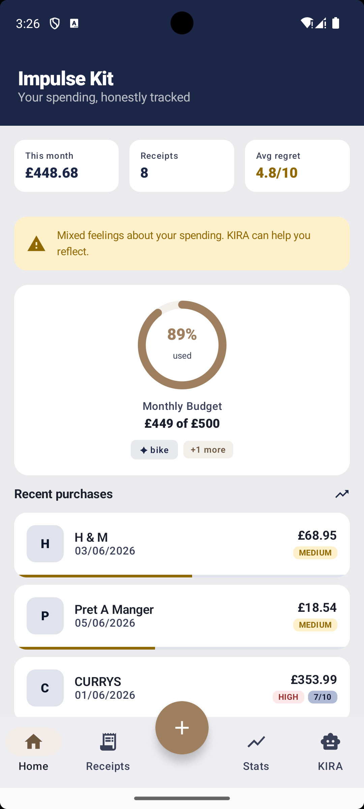</td>
    <td align="center">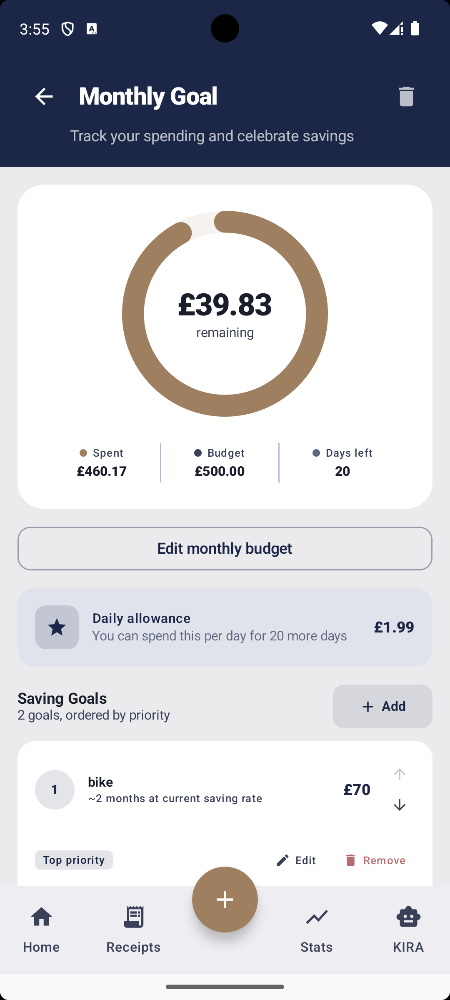</td>
    <td align="center">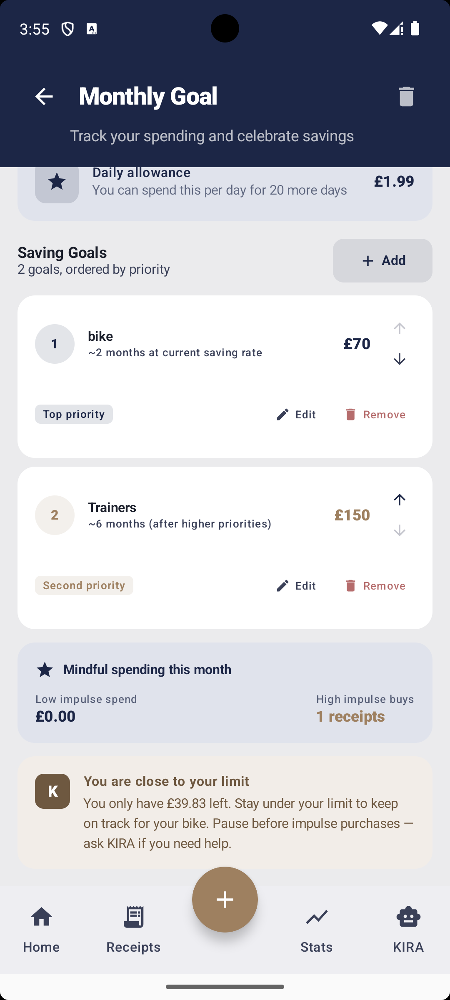</td>
  </tr>
  <tr>
    <td align="center">The home page consists of spend summary, impulse-labelled receipts and live budget donut</td>
    <td align="center">The donut arc tracks your monthly allowance</td>
    <td align="center">With the monthly budget feature you are able to set 'mini' goals for what you actually want and plan to buy if you have leftover money in your monthly allowance</td>
  </tr>
</table>

<br/>

<table width="100%">
  <tr>
    <td width="33%" align="center"><b>Receipts Scanned page</b></td>
    <td width="33%" align="center"><b>Gallery</b></td>
    <td width="33%" align="center"><b>Individual Receipt page</b></td>
  </tr>
  <tr>
    <td align="center">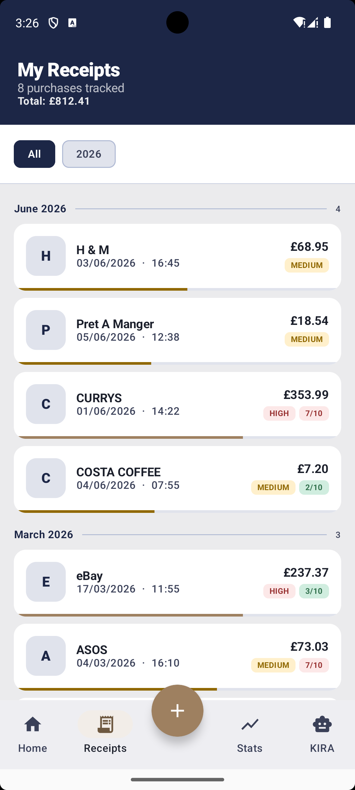</td>
    <td align="center">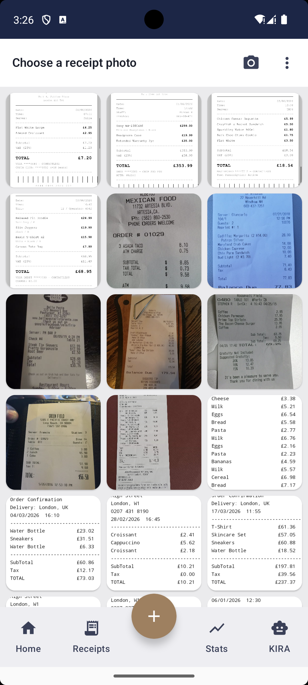</td>
    <td align="center">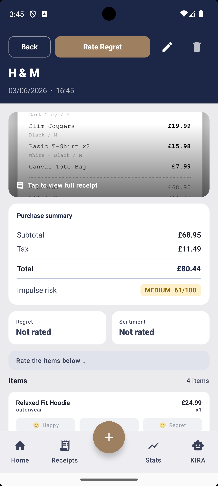</td>
  </tr>
  <tr>
    <td align="center">You can view your full purchase history grouped by months with impulse labels, designed to label purchases that seem to be a necessity or an unnecessary purchase</td>
    <td align="center">You can access the camera to scan your receipt or scan a receipt that exists in your gallery</td>
    <td align="center">When the receipt is scanned you will be moved to this page, where you can view your receipt electronically</td>
  </tr>
</table>

<br/>

<table width="100%">
  <tr>
    <td width="50%" align="center"><b>Rate items</b></td>
    <td width="50%" align="center"><b>Rate Shopping Experience</b></td>
  </tr>
  <tr>
    <td align="center">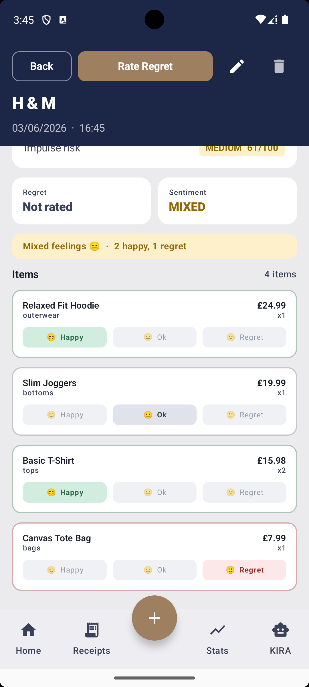</td>
    <td align="center">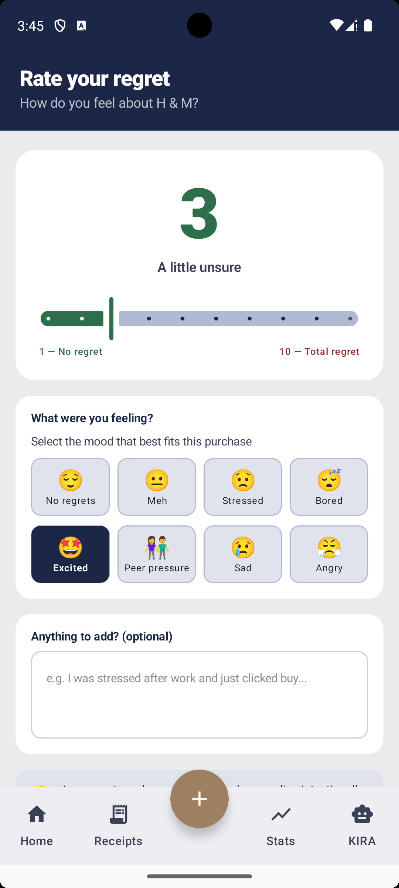</td>
  </tr>
  <tr>
    <td align="center">As you move further down the page the real magic begins, you can rate your decision of purchasing each item off your receipt and make a verdict of whether it was a good or bad purchase decision</td>
    <td align="center">At the top of the page click 'Rate Regret' where you will be directed to this page, you can rate the overall shopping experience with the slider and add a small note for yourself as a reflection of your shopping trip</td>
  </tr>
</table>

<br/>

<table width="100%">
  <tr>
    <td width="33%" align="center"><b>Statistics 1</b></td>
    <td width="33%" align="center"><b>Statistics 2</b></td>
    <td width="33%" align="center"><b>Statistics 3</b></td>
  </tr>
  <tr>
    <td align="center">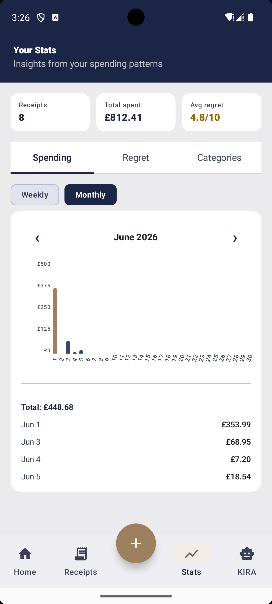</td>
    <td align="center">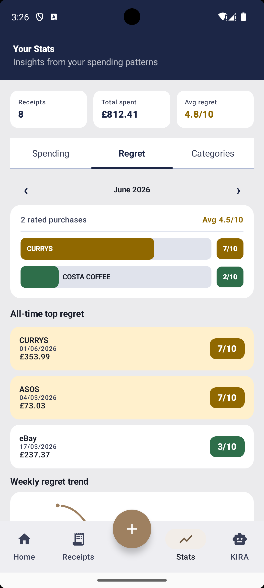</td>
    <td align="center">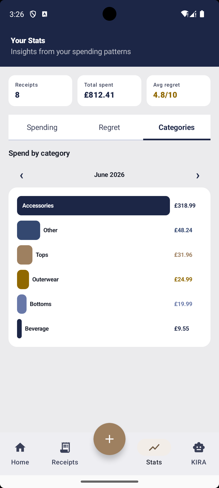</td>
  </tr>
  <tr>
    <td align="center">The first graph is your spending bar chart with daily insight of how much you have spent, the chart can be viewed weekly or monthly</td>
    <td align="center">The regret stats show you your regret scores for each purchase and highlights your all-time top regret list</td>
    <td align="center">In the categories page you can view where you have spent most of your money for each month</td>
  </tr>
</table>

<br/>

<table width="100%">
  <tr>
    <td width="50%" align="center"><b>KIRA</b></td>
    <td width="50%" align="center"><b>Example of KIRA's Response</b></td>
  </tr>
  <tr>
    <td align="center">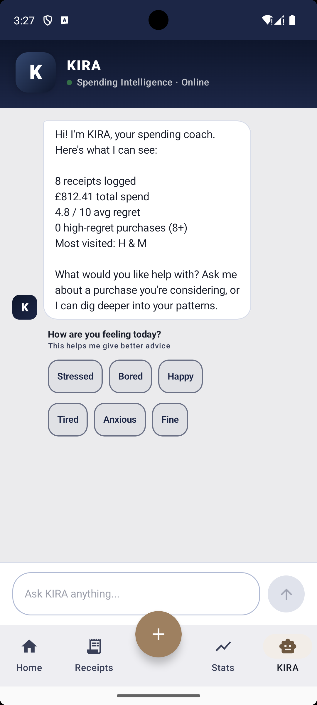</td>
    <td align="center">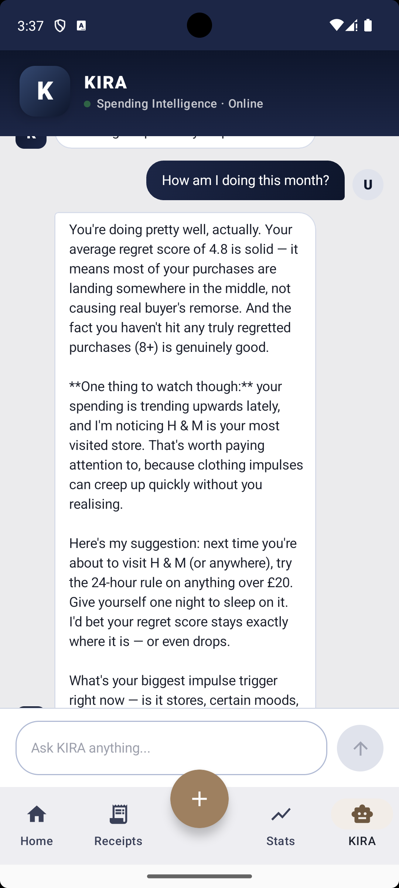</td>
  </tr>
  <tr>
    <td align="center">This is KIRA, your personal coach. She opens every conversation with a summary of your real spending data and asks how you are feeling today so her advice is tailored to your mood.</td>
    <td align="center">KIRA gives personalised responses based on your real purchase history and spending patterns. She is designed to be supportive and provide advice that is specific to your experiences, not generic financial tips.</td>
  </tr>
</table>


### Tech Stack
| | Technology | Why |
|---|---|---|
| Language | Kotlin | Modern, concise, null-safe |
| UI | Jetpack Compose + Material 3 | Declarative UI, 2025 design system |
| Architecture | MVVM + StateFlow | Reactive, testable, lifecycle-safe |
| Database | Room DB | On-device storage, no user data leaves the phone |
| AI parsing | Anthropic Claude API | Handles messy real-world receipt formats reliably |
| AI chat | Anthropic Claude API | Personalised responses using live spending data |
| OCR | Google ML Kit | Fast, on-device text extraction |
| Charts | Vico | Smooth, composable chart library |
| Images | Coil | Async image loading with pinch-to-zoom |
| Navigation | Jetpack Navigation Compose | Type-safe, single-activity |
| Async | Kotlin Coroutines + Flow | Structured concurrency throughout |


### Architecture 
The app follows a clean MVVM architecture with a repository pattern separating the database from the UI layer.

```
app/
├── MainActivity.kt                  Entry point, receipt scan orchestration
├── ClaudeReceiptParser.kt           Claude API receipt parsing
├── AnthropicApiClient.kt            HTTP client for Anthropic API
├── ImpulseScorer.kt                 On-device impulse scoring engine
├── ParsedReceipt.kt                 Receipt data model
│
├── database/
│   ├── AppDatabase.kt               Room database, version management
│   ├── ReceiptRepository.kt         Single source of truth for all data
│   ├── dao/                         Data Access Objects (6 DAOs)
│   ├── entities/                    Room entities — Receipt, Item, Goal,
│   │                                SavingGoal, Emotion, ItemReaction
│   └── models/                      Query result models (CategorySpend etc.)
│
├── navigation/
│   ├── Screen.kt                    Type-safe navigation routes
│   └── BottomNavItem.kt             Bottom nav configuration
│
├── ui/
│   ├── AppRoot.kt                   Scaffold, NavHost, bottom nav with FAB
│   ├── screens/                     All composable screens (13 screens)
│   ├── charts/                      Vico chart composables
│   └── theme/                       Material 3 colour scheme and typography
│
└── viewmodel/
    ├── ReceiptViewModel.kt           All receipt/goal/stats state
    └── SuggestionBotViewModel.kt     KIRA chat state and system prompt
```
---
## Why On-Device Impulse Scoring? 
The impulse score runs without a network call using written rules. This keeps it fast (instant feedback), consistent (same input always give the same score), and explainable (the users can understand why a purchase is scored HIGH or LOW). Claude is used for conversation purposes, to make users feel comfortable enough to find their underlying trigger for their financial choices.

## Why Room instead of a Remote Database?
Spending data is sensitive, hence why Room is used, it allows everything to stay on the device. The only data that leaves the phone is a receipt text which is sent for AI parsing, this requires a privacy consent before the first scan. 


## Setup
### Conditions
- Android Studio Hedgehog or later
- Android SDK 26+
- An [Anthropic API key](https://console.anthropic.com)

### Installation
 
**1. Clone the repo**
```bash
git clone https://github.com/a-tajarab/ImpulsePurchaseRecoveryKit.git
```
 
**2. Add your API key**
 
Create `local.properties` in the project root (it is gitignored and will never be committed):
```
ANTHROPIC_API_KEY=your_key_here
```
 
**3. Verify `app/build.gradle.kts` exposes the key to BuildConfig**
```kotlin
buildConfigField("String", "ANTHROPIC_API_KEY",
    "\"${localProperties["ANTHROPIC_API_KEY"] ?: ""}\"")
```
 
**4. Run**
 
Open in Android Studio and press Run, or:
```bash
./gradlew assembleDebug
```
---

## Author
 
**Ayesha Tajarab** - Android Developer
#### LinkedIn - (https://www.linkedin.com/in/ayesha-tajarab-aa329b24b)
---
